# Seguridad en Internet de las Cosas (IoT e IIoT)

**Trabajo Práctico — Seguridad en Sistemas de Información (SSI)**
**Grupo 18**

> *«Cada objeto conectado es una puerta; desde el hogar hasta la industria.»*
> — frase del acertijo que da origen al tema.

---

## Resumen

Internet de las Cosas (IoT) y su variante industrial (IIoT) conectan a
la red miles de millones de dispositivos físicos: sensores, actuadores,
cámaras, electrodomésticos, controladores industriales. Cada uno amplía
la superficie de ataque de los sistemas de información. Este trabajo
analiza las causas estructurales de la inseguridad en IoT/IIoT —
credenciales por defecto, ausencia de cifrado y autenticación, y falta
de actualizaciones— y las ilustra con una prueba de concepto ejecutable:
un nodo industrial simulado (ESP32) que se comunica por MQTT con un
broker, atacado desde otra máquina de la misma red de laboratorio, y
luego protegido con contramedidas estándar. Se toma la botnet **Mirai**
como caso de estudio del impacto a escala.

> **Alcance y ética.** La POC se ejecuta íntegramente sobre equipos y red
> propios del grupo, con fines educativos. Las técnicas ofensivas se
> emplean para comprender y mitigar el riesgo. Su uso contra sistemas de
> terceros sin autorización es ilegal y queda fuera de este trabajo.

---

## 1. Introducción

El cómputo dejó de estar confinado a servidores y computadoras personales.
Hoy la lógica y la conectividad viven también en objetos cotidianos y en
equipamiento industrial. Esta expansión trae beneficios enormes —
telemetría, automatización, mantenimiento predictivo— pero traslada los
problemas clásicos de seguridad a dispositivos que rara vez fueron
diseñados con la seguridad como prioridad.

La frase del acertijo resume la tesis del trabajo: **cada objeto
conectado es una puerta**. Una puerta mal cerrada en una cámara hogareña
o en un sensor de planta es un punto de entrada a la red y, en el caso
industrial, un camino hacia el mundo físico.

### 1.1 IoT vs. IIoT

- **IoT (consumo):** dispositivos de hogar y uso personal (cámaras,
  termostatos, wearables, asistentes). Gran volumen, bajo costo, poca o
  nula gestión de seguridad por parte del usuario.
- **IIoT (industrial):** sensores y actuadores en plantas, logística,
  energía y servicios. Menor volumen pero **mayor criticidad**: un fallo
  afecta producción, seguridad física de personas y continuidad
  operativa. Convergen con el mundo OT (Operational Technology) y los
  sistemas ICS/SCADA.

La diferencia clave para seguridad es el **impacto**: en IoT de consumo
domina la pérdida de privacidad y el uso del dispositivo como peón
(botnet); en IIoT se suma el daño físico, económico y a la seguridad de
las personas.

---

## 2. Por qué IoT/IIoT es inseguro: causas raíz

### 2.1 Credenciales por defecto

Muchos dispositivos salen de fábrica con usuario/contraseña conocidos
(`admin/admin`, `root/root`) y no obligan a cambiarlos. Esas
credenciales están publicadas y se prueban masivamente. Es el vector que
explotó Mirai (§5).

### 2.2 Ausencia de cifrado y autenticación

Protocolos como **MQTT** o CoAP, muy usados en IoT, **no cifran ni
autentican por defecto**. Si el despliegue no agrega TLS y control de
acceso, el tráfico viaja en texto plano y cualquiera en la red puede
leerlo e inyectar mensajes. Esto es exactamente lo que demuestra nuestra
POC.

### 2.3 Falta de actualizaciones (patching)

Los dispositivos suelen carecer de un mecanismo de actualización seguro
(OTA firmado) o dejan de recibir soporte. Vulnerabilidades conocidas
quedan sin parchear durante años, en equipos que viven una década en
campo. La ventana de exposición es enorme.

### 2.4 Superficie amplia y redes planas

El número de dispositivos y su despliegue en **redes planas** (IoT
conviviendo con IT/OT sin segmentación) hace que comprometer un nodo
débil abra el paso lateral al resto. Además, muchos quedan expuestos a
Internet sin necesidad.

### 2.5 Restricciones de hardware y time-to-market

CPU, memoria y energía limitadas dificultan criptografía robusta; y la
presión comercial prioriza funcionalidad sobre seguridad. El resultado
es "inseguro por defecto".

---

## 3. Modelo de amenaza (MQTT en una planta)

Tomamos como objeto el protocolo MQTT, dominante en IoT/IIoT. Un broker
central recibe publicaciones (*publish*) en *topics* y las reparte a los
suscriptores. En nuestro escenario:

- **Activos:** integridad de las lecturas del sensor, control del
  actuador, disponibilidad del proceso, confidencialidad de la
  telemetría.
- **Atacante:** adversario en la misma red L2/L3 que el broker (invitado
  en la Wi-Fi, equipo comprometido, dispositivo rogue). No necesita
  credenciales si el broker es anónimo.
- **Superficies:** broker abierto (anónimo), tráfico sin TLS, clientes
  que no validan el origen de los mensajes.

Mapeado a la tríada **CIA**:

| Propiedad | Ataque en la POC | Script |
|---|---|---|
| Confidencialidad | Lectura de todo el tráfico | `sniff.py` + `tshark` |
| Integridad | Inyección de lecturas falsas | `spoof_sensor.py` |
| Disponibilidad / seguridad física | Comandos no autorizados al actuador | `inject_command.py` |

---

## 4. Prueba de concepto (POC)

### 4.1 Arquitectura

Un **ESP32** simula un nodo industrial: mide el "nivel de un tanque" con
un sensor ultrasónico (HC-SR04) y acciona una "válvula" (servomotor) con
LED y buzzer. Publica el nivel por MQTT y se suscribe a un topic de
comandos. Un **mini-SCADA** (Python) monitorea y cierra un lazo de
control automático. Todo pasa por un **broker Mosquitto** en una PC del
grupo. Una **segunda PC** cumple el rol de atacante en la misma red.

```
[ESP32 sensor/actuador] --MQTT(1883)--> [Broker Mosquitto] <-- [SCADA]
                                              ^
                                         [Atacante PC-B]
```

El código completo está en `../poc/` y el paso a paso en
`demo-guion.md`.

### 4.2 Fase 1 — broker inseguro (el estado "por defecto")

El broker se configura con `allow_anonymous true` y sin TLS
(`mosquitto-insecure.conf`), reproduciendo la mala práctica más común.

1. **Sniffing (confidencialidad).** `sniff.py` se conecta sin
   credenciales, se suscribe a `#` y observa todos los topics. A nivel de
   red, `tshark -Y mqtt` muestra los payloads en texto plano.
2. **Spoofing de sensor (integridad).** `spoof_sensor.py` publica en el
   topic del sensor valores falsos. El SCADA los toma como verdaderos:
   un ataque de *false data injection* clásico en entornos ICS.
3. **Comando no autorizado (seguridad física).** `inject_command.py`
   publica en el topic de la válvula. El ESP32 —que no valida el origen—
   ejecuta: abre la válvula o dispara la alarma sin orden del operador.

### 4.3 Fase 2 — broker endurecido (la mitigación)

Se cambia a `mosquitto-secure.conf`: TLS en 8883, autenticación por
usuario/contraseña y ACL por topic (mínimo privilegio). Se re-ejecutan
los mismos ataques y fallan:

- el sniffer no encuentra puerto plano y, sobre TLS, es rechazado por
  falta de credenciales; el tráfico capturado va cifrado;
- la inyección de comandos es rechazada por autenticación/ACL.

El contraste entre ambas fases es el núcleo pedagógico: la inseguridad
de IoT **no es inevitable**, es configuración por defecto y falta de
mantenimiento.

### 4.4 Evidencia de la demo en laboratorio

Las siguientes imágenes corresponden a la corrida real de la POC sobre
equipo y red propios del grupo (demo con dos notebooks: una como
broker/operador y otra como atacante).

#### Montaje físico

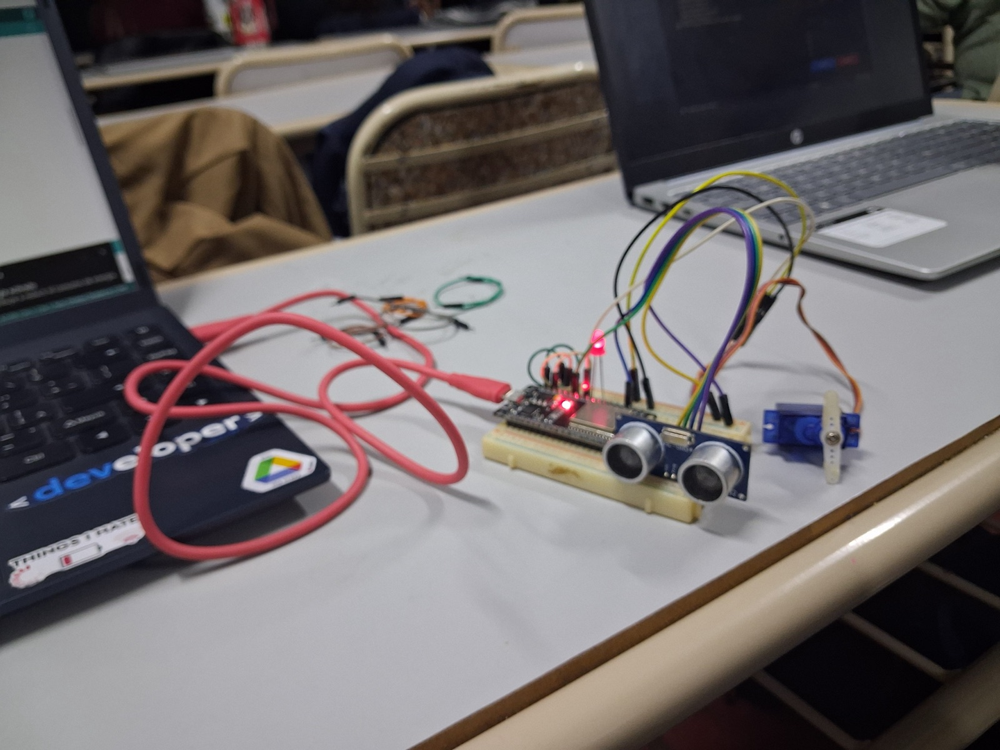
*Figura 1 — Banco de la demo: el nodo ESP32 (derecha) y las notebooks del broker/SCADA y del atacante, en la misma red.*

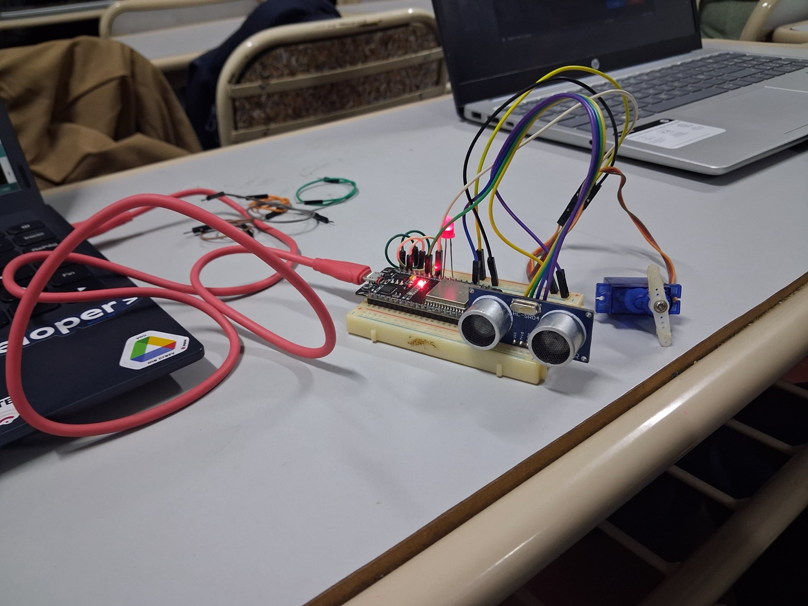
*Figura 2 — Nodo IIoT: ESP32 + sensor ultrasónico HC-SR04 ("nivel"), servo ("válvula") y LED de estado.*

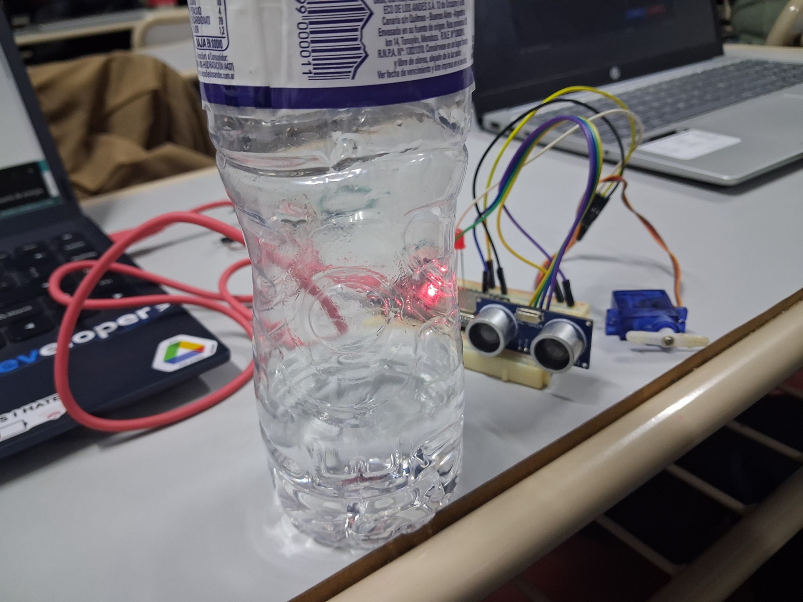
*Figura 3 — El "tanque" simulado: una botella frente al sensor; acercando o alejando la superficie se varía el nivel medido.*

#### Arranque del nodo

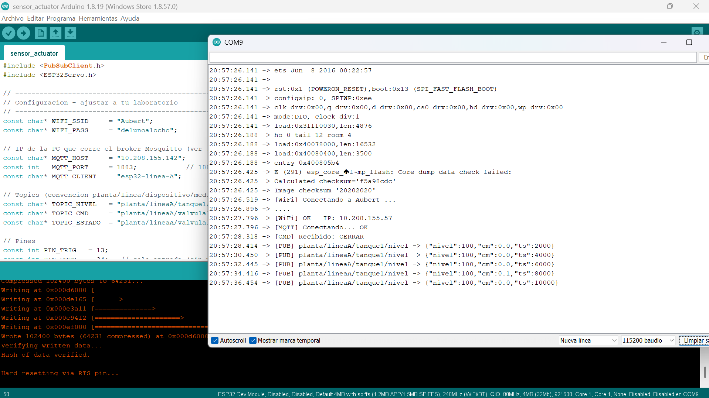
*Figura 4 — Arranque del ESP32 en el Monitor Serie: conexión WiFi (IP del hotspot), MQTT OK y publicación de telemetría.*

#### Operación normal

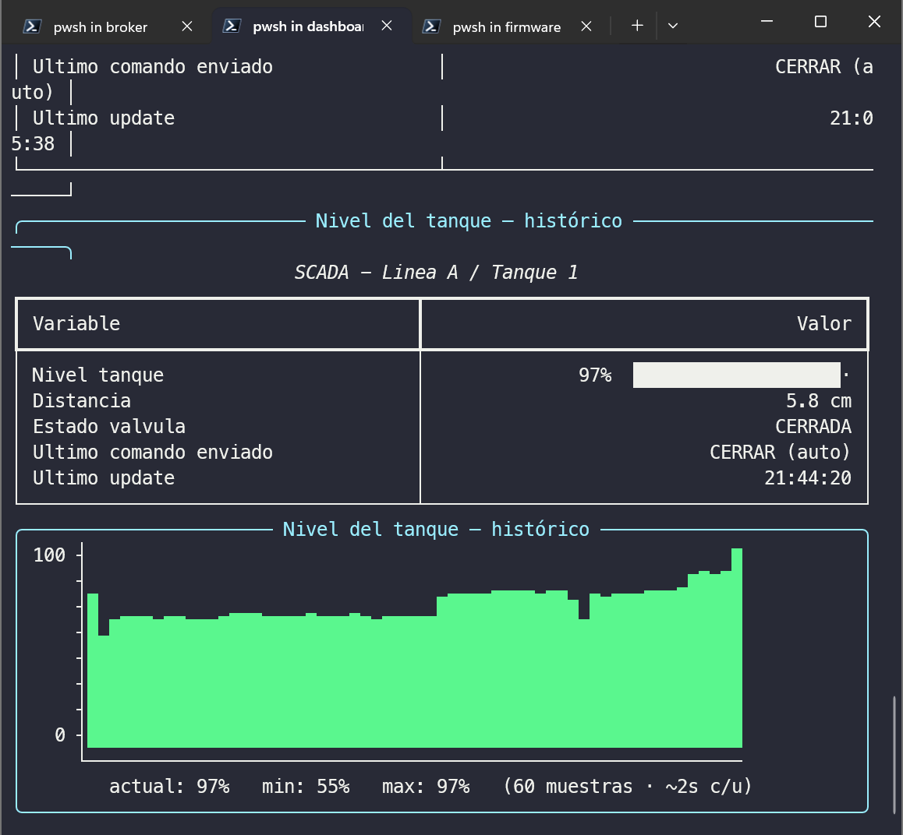
*Figura 5 — SCADA en operación normal: nivel 97 %, válvula cerrada, histórico estable.*

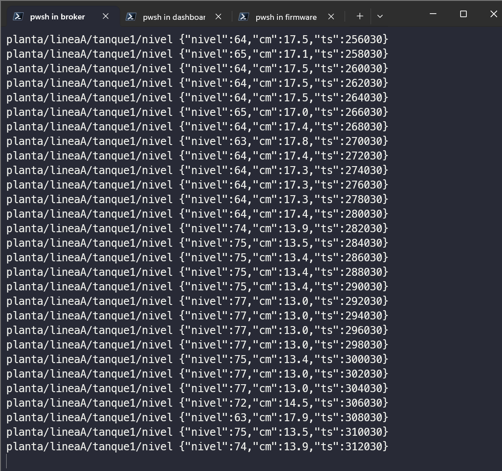
*Figura 6 — Telemetría publicada por el nodo, vista desde el broker en texto plano (topic `planta/lineaA/tanque1/nivel`).*

#### Ataque 1 — Sniffing (confidencialidad)

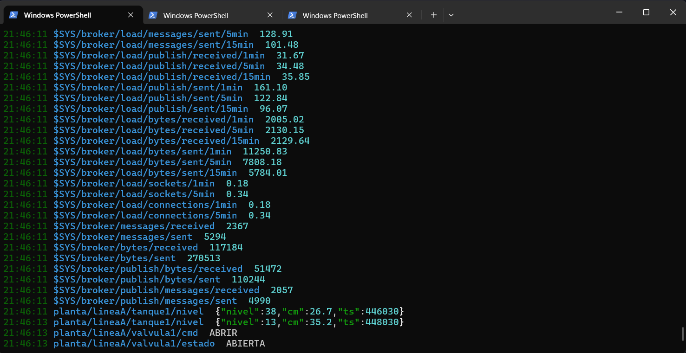
*Figura 7 — Con el broker abierto, el atacante suscripto a todo lee la telemetría, los metadatos del broker (`$SYS/#`) y los comandos a la válvula.*

#### Ataque 2 — Inyección de datos falsos (integridad)

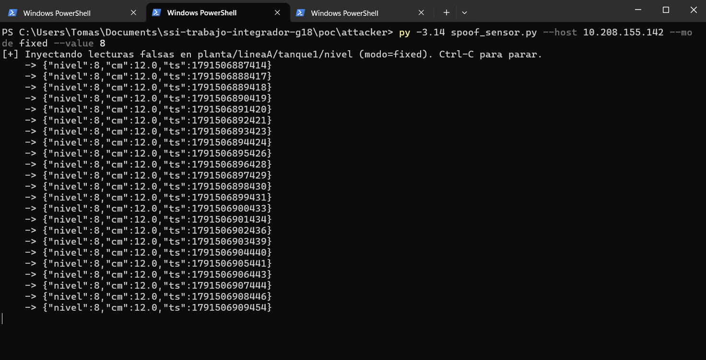
*Figura 8 — `spoof_sensor.py` inyectando lecturas falsas (nivel 8 %) en el topic del sensor desde la máquina atacante.*

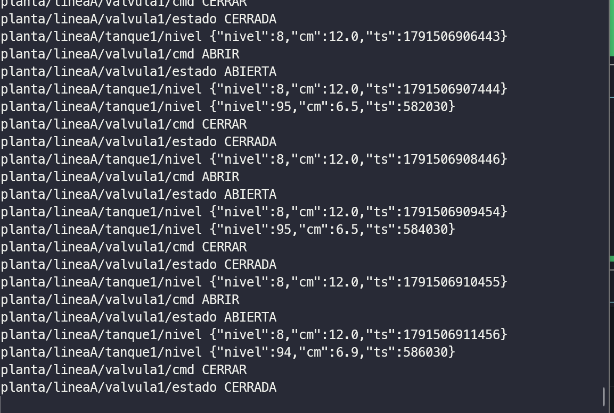
*Figura 9 — Lecturas reales (nivel 95) y falsas (nivel 8) conviviendo en el mismo topic: el operador recibe datos contradictorios.*

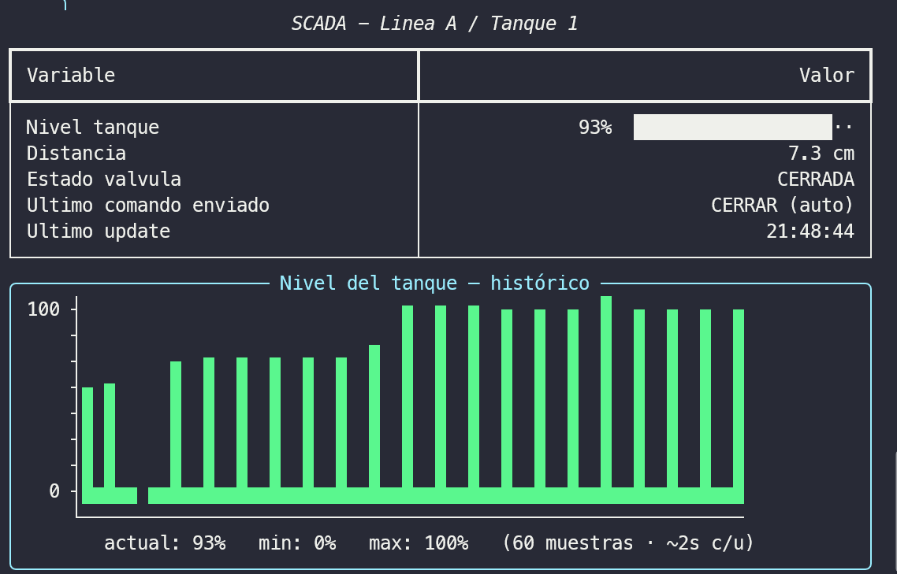
*Figura 10 — Impacto en el SCADA: el histórico se vuelve una oscilación artificial, imposible en la dinámica real de un tanque.*

#### Ataque 3 — Comando no autorizado (seguridad física)

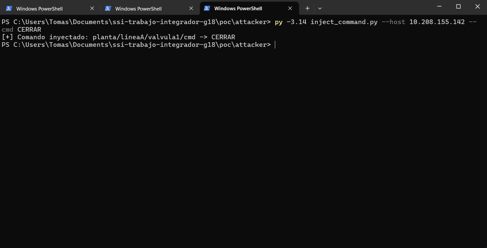
*Figura 11 — `inject_command.py` publica directamente `CERRAR` en el topic de la válvula, sin autenticación: el actuador obedece a un emisor no autorizado.*

> Capturas adicionales (más paneles del SCADA, sniff del cierre de
> válvula, spoofing fijo en 80 %, etc.) y las fotos en resolución
> original están en [`img/capturas/`](img/capturas/) e
> [`img/originales/`](img/originales/).

---

## 5. Caso de estudio: botnet Mirai (2016)

Mirai es el ejemplo canónico del impacto de las causas raíz de la §2.
Su funcionamiento resume el problema:

1. **Escaneo** de Internet buscando dispositivos IoT (cámaras IP, DVRs,
   routers hogareños) con Telnet/SSH abierto.
2. **Credenciales por defecto:** probaba una lista corta de
   usuario/contraseña de fábrica. Bastaba eso para tomar el dispositivo.
3. **Reclutamiento** del equipo a una botnet, sin que el dueño lo note.
4. **Ataques DDoS** masivos desde cientos de miles de dispositivos.

Con Mirai se ejecutaron algunos de los mayores DDoS registrados hasta
entonces, incluyendo el ataque al proveedor de DNS **Dyn**, que dejó
intermitentes a servicios muy populares de Internet. Lecciones directas:

- credenciales por defecto + exposición a Internet = compromiso masivo;
- el daño no lo sufre solo el dueño del dispositivo, sino **terceros**
  (la Red como víctima colateral);
- la falta de actualizaciones mantuvo variantes activas mucho después.

El salto a IIoT agrava el cuadro: donde Mirai usó cámaras para DDoS, un
adversario sobre actuadores industriales puede afectar producción,
equipos y seguridad de personas —como ilustra, a escala de laboratorio,
nuestra POC.

---

## 6. Contramedidas y buenas prácticas

Resumen alineado con la POC (detalle en `../poc/mitigations/README.md`):

1. **Cifrado en tránsito (TLS).** Elimina el sniffing de payloads.
2. **Autenticación fuerte, sin anónimos.** Credenciales únicas por
   dispositivo; idealmente certificados de cliente, no contraseñas
   compartidas. Nunca credenciales de fábrica.
3. **Autorización de mínimo privilegio (ACL).** Cada identidad solo
   publica/suscribe en sus topics; contiene el daño de una credencial
   robada.
4. **Validación en el dispositivo.** El actuador no debe obedecer
   mensajes sin autenticar; validar origen e integridad.
5. **Actualizaciones seguras (OTA firmado).** Poder parchear durante
   toda la vida útil del equipo.
6. **Segmentación de red (OT/IT, VLAN) y exposición mínima.** No publicar
   brokers a Internet; acceso remoto solo por VPN.
7. **Monitoreo / detección de anomalías.** Alertar ante dos "sensores"
   en el mismo topic, comandos fuera de horario o volúmenes anómalos.
8. **Secure by design / secure by default.** Forzar cambio de
   credenciales al primer uso; desactivar servicios innecesarios.

Estas medidas se corresponden con marcos de referencia reconocidos
(p. ej. **OWASP IoT Top 10**, guías de **NIST** para IoT y
recomendaciones de **IEC 62443** para seguridad industrial).

---

## 7. Conclusiones

- IoT/IIoT trasladan los riesgos de ciberseguridad a objetos físicos y
  a procesos industriales, ampliando drásticamente la superficie de
  ataque: cada objeto conectado es, literalmente, una puerta.
- Las causas de la inseguridad son recurrentes y en gran medida
  evitables: credenciales por defecto, ausencia de cifrado/autenticación
  y falta de actualizaciones, sobre redes poco segmentadas.
- La POC muestra, de punta a punta, cómo esas debilidades permiten leer
  el proceso, falsear datos y controlar actuadores desde la misma red —
  y cómo contramedidas estándar (TLS + autenticación + ACL +
  segmentación) neutralizan los mismos ataques.
- Mirai evidencia el impacto a escala y el carácter colectivo del
  problema: un dispositivo inseguro no solo compromete a su dueño.
- La seguridad en IoT/IIoT es, ante todo, una cuestión de diseño y
  operación responsables más que de tecnología faltante.

---

## 8. Referencias (para completar con formato de la cátedra)

- OWASP IoT Top 10.
- NIST — Guías de ciberseguridad para IoT (serie NISTIR / SP).
- IEC 62443 — Seguridad en sistemas de automatización y control
  industrial.
- Documentación de MQTT (OASIS) y de Eclipse Mosquitto (TLS, auth, ACL).
- Análisis técnicos de la botnet Mirai y del ataque a Dyn (2016).

> *Nota:* reemplazar por las citas con el formato y las fuentes exactas
> que pida la cátedra (APA/IEEE), verificando cada dato antes de la
> entrega.
